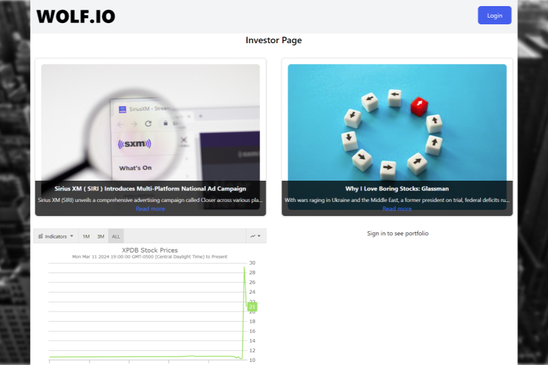

# Stock Portfolio

Please visit the [Stock Portfolio](https://stock-portfolio-app-0d5fa262dd91.herokuapp.com/) website.

## Description
Stock Portfolio is a website where users can view and buy stocks \(no actual stocks are purchased through this website\).

## Installation

This website works best when using a current version of Firefox or Chrome.

## Usage

When you visit the site you can view news articles and the highest gaining and lowest dropping stocks.  To login or register click on the login button in the upper right corner.  Once logged in you can view search for and purchase a stock for your portfolio on the search page.  You can also visit the portfolio page to view a graph with your portfolio stocks.

## Credits
Special thanks to our contributers:

-Dan, [DB-Doo](https://github.com/DB-Doo)

-Jack, [thejackbitt](https://github.com/thejackbitt)

-Kevin, [KDeLaria](https://github.com/KDeLaria)

-Pete, [petemaynard](https://github.com/petemaynard)

## License
N/A